### 1. Project name: Learning Javascript functions

### 2. Background of creating Javascript

- Needs for dynamic website is considered by Marc Andreessen from Netscape and Script language was created in 1993. Script language means tool that inserts in application and supports to operate what user want easily. Javascript is one of script language. Marc Andreessen and Brendan Eich developed Livescript that was super flexible language on Sep 1994, and then, interpreter was also developed for browser. Java lead to programing language trend at that time, so name of Livescript was changed to Javascript to copy popularity with public and increase brand image. Javascript finally launched with interpreter in 1995.

### 3. Period : 2 week

### 4. Display Outputs with Javascript

#### 4-1. Methods of displaying webpage

- In case script tag is included in head tag, browser would parse HTML data and combine with css file, and then, transfered to DOM(Document Object Model) element for matching web API when user download HTML file on webpage. All procedure should be executed in sequence. Parsing HTML should be stopped for fetching and executing js file. So, webpage seems like stopped for a while. It is possible for user to see data on webpage very slowly if internet speed is very slow or size of js file is very huge.

  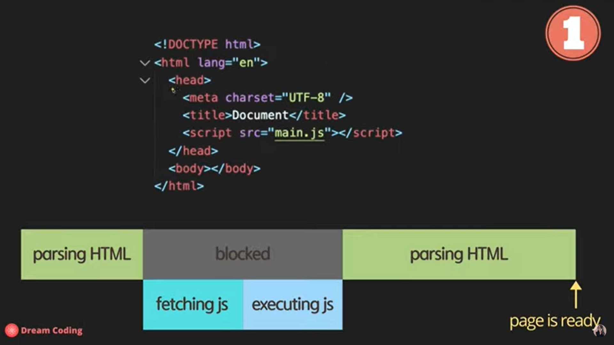

- In case script tag is included on end of body tag, user could see first page of webpage more quickly than before. because browser parse HTML data in sequence and first webpage is ready before starting to fetch js file. However, because browser start to fetch and execute js file, webpage would also be slow if user click any button for watching useful content on webpage.

    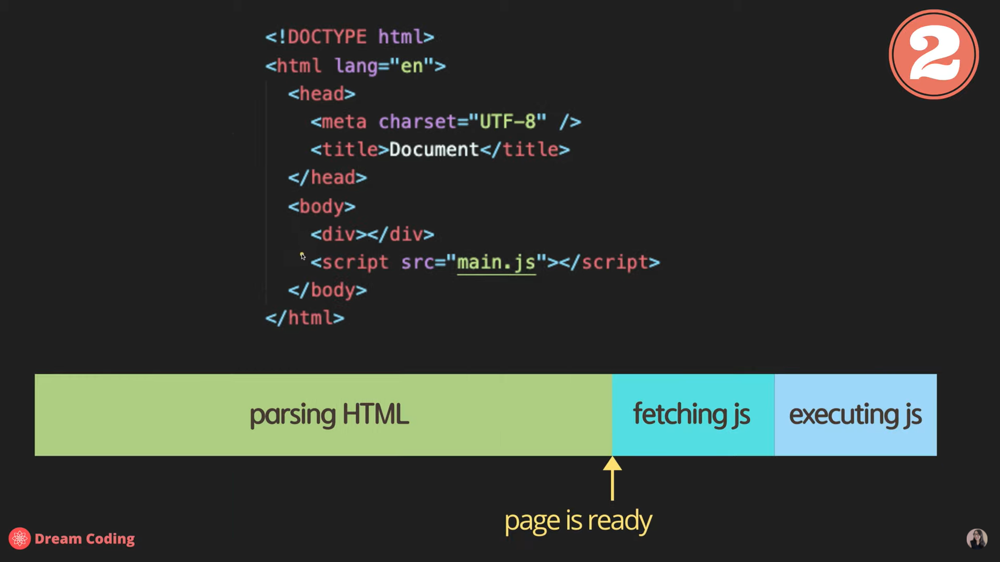

- In case use asyn attribute and script tag is included in head tag, browser would parse HTML data and fetch js file in parallel, stopped to executing js file. Parsing HTML would restart after completed executing js file. It is not enough for user to see webpage more quickly than expected. There is risk to do not defined HTML data which is needed to javascript when working DOM attribute. It would not operate correctly as developer intended. The DOM means format of data would be transfered for matching API. Defined asyn in head tag would execute to true and operated correctly because asyn is attrubute of boolean type.

  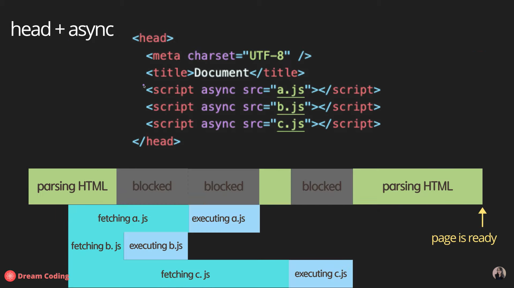

- In case use defer attribute and script tag is included in head tag, browser would parse HTML data and fetch js file in parallel, and then, execute js file after completed parsing HTML. Defer option would be better than other options because webpage offer user first main page and execute js files in sequence.

  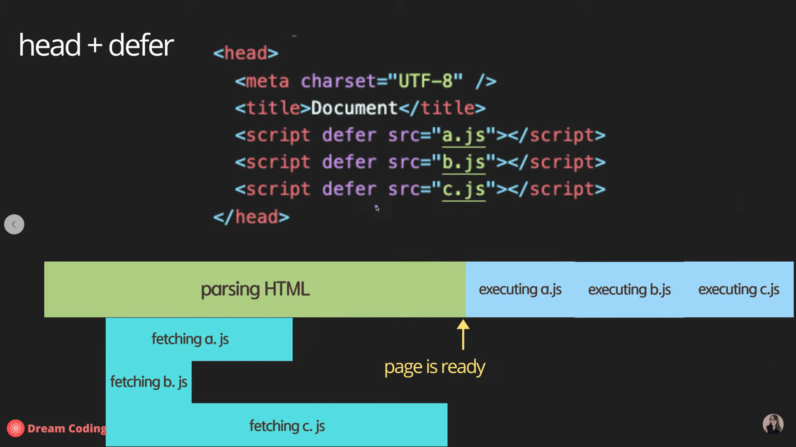

#### 4-2. Protection methods for reducing mistakes with dynamic typing

- `'use strict'`: Javascript language is very flexible, so you can assign value of variable even though the variable is not defined. `'use strict'` help assign value of variable after you define variable. Type error would be displayed on console because value of variable can not be assigned when the variable is not defined yet. regardless of keyword `let` or `var`, most of language is considered this protection.
  Keyword `var` is not recommended because you can assign value of not-defined variable if you can not use `'use strict'`. In contrast, keyword `let` can assign value of variable after the variable is defined. so, `let` is recommended among developers.

- In case dynamic typing could make user mistake even though you use keyword `let` like below.
  let text = 'hello';
  console.log(text.charAt(0));
  console.log(`value: ${text}, type: ${typeof text}`);
  text = 1;
  console.log(text.charAt(0));
  As value of text is changed to number like 1, there is type error like index conflict. It is easy that runtime error occurr and it is difficult for developer to find root cause. So, this background results in creating typescript language. The typescript language always define variable with type.

- charArt(index) is function and the function should use not only type of input is string but also type of output is char.

#### 4-3. Display output on console tab with node.js

- In case you want to see output on console tab, HTML and `main.js` usually should be connected with server. However, in case of using `node.js`, you can see output on console tab of local cmd configuration without server. `node.js` and `web API` have same `console API`. So, message could display on console tab using node.js without connection. API means protocol and group of functions which are offered by browser and browser could understand the protocol. API is not language of javascript. It would also be better to study console API spec at developer.mozilla.org for good understanding. `alert()` is also one of API. `` will be used for dynamic element on situation such as clicking the button on website.

- `node main.js`: Output from main.js would be printed on console tab with `node.js` if you installed `node.js`. OS should be restarted after installed framework of `node.js`. `node.js` could be operated correctly as printed output on console tab after rebooting OS. You can execute output without broswer because `node.js` has javascript engine.

### 5. Defined data type

#### 5-1. Variable

- The most important of programming language is input, operators with functions, suitable output according to user intent. Input may contain Tx and Rx with server depending on situation.
  In addition, it is also important to build logic optimized for CPU, minimize memory.

- Variable : Variable has value that could be changed to other value. This is mutable type. Read and write could be possible.

- Blocks of memory should be assigned on limited basis for normal operation per application.

  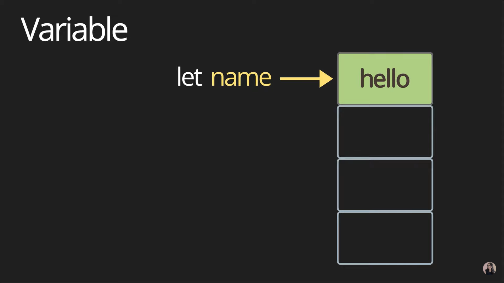

- let name = 'minkyu';
  console.log(name);
  name = 'hello';
  consol.log(name);

- Let is mutable data type. Pointer would be created to refer block of memory if keyword 'let' define variable 'name'. the block of memory can save value of variable 'minkyu'. the value would also be changed from stack memory to the block of memory if the value 'minkyu' is changed to 'hello'.

- `{}` means block scope and local scope. you cannot get normal output if whether variable is defined or value of variable is defined within block scope. However, in case of global scope variable, you can get correct output no matter where within block scope or outside block scope.

- let globalMessage = 'global'; // global variable
  function printMessage() {
  let message = 'hello'; // local variable
  console.log(message);
  console.log(globalMessage);
  }
  console.log(message);
  console.log(globalMessage);

- Output of message should not be displayed on console when used `console.log(message);` outside block scope, because message defined within block scope. In contrast, in case of `console.log(globalMessage)`, output should be displayed on console because golbalMessage is global variable.

#### 5-2. Constant

- Constant is immutable data type. Read only because locked pointer would be created to refer block of memory if keyword `const` define variable. The reason why favor immutable data type always is security, thread safety among some of threads that use same variable, reduce human mistakes.

#### 5-3. Data types closed to variable

- Primitive, single item : number, string, boolean, null, undefined, symbol.
- Object: group of single items with block scope.
- Box container: container could become object or group of object. It seems like class or selector.
- Function is also object in JS. Function commonly supports first-class function in JS. The first-class function means that function could be assigned to parameter in other function and return type of function could be used to parameter in other function.
- No returned value means `return undefinded`. This would be generally omitted.
- `Infinity = 1/0` : It could become infinity value.
  `NagativeInfinity = -1/0` : It could become nagativeinfinity value.
  `NaN` : string/0 : It could become NaN(Not a Number).
- String
  const char = 'c';
  const brandan = 'branden';
  const greeting = 'hello' + branden;
  console.log(`value: ${greeting}, type: ${typeof greeting}`);
  const helloBob = `hi ${brandan}!`; // template literals (string)
  console.log(`value: ${helloBob}, type: ${typeof helloBob}`);
  Value with '' means type of string. In case value type of string added variable which has value type of string, It is possible to get correct output. Template literal means to use backtiks for which easily you make string. It is useful to get output without `+` because format of sentence of string should be used and it could be inserted what you want with `${}`.

- boolean
  False: 0, null, undefined, NaN, ''. Expression like `3 < 1` is assgined to value of false automatically.
  True: any other value like 1. It will be assigned to value of true that value is defined true or 1.

- null : variable is defined and value is assigned empty.
  let nothing = null;

- undefined : variable defined but, value is not defined yet.

- symbol
  const symbol1 = Symbol('id');
  const symbol2 = Symbol('id');
  console.log(symbol1 === symbol2);
  There are deferent values between symbol1 and symbol2 even though values of string are same.
  so, these will be used for creating unique identifiers for objects.
  In case you want same symbols with same values, refer below.
  const symbol1 = Symbol.for('id');
  const symbol2 = Symbol.for('id');
  console.log(symbol1 === symbol2);
  console.log(`value: ${symbol1}, type: ${typeof symbol1}`);
  This code will be type error because value of symbol1 should be changed to string. Added `.description` like below if you want correct output.
  console.log(`value: ${symbol1.description}, type: ${typeof symbol1}`);

- Object
  Size of object is very huge and can not assigned the object itself on memory. Adress named `refer` pointed object would be assigned on the memory when the object is defined at once. So, if subobjects used, the subobjects could be changed and just parent object would be locked when you use `const object`. Default of object is mutable type in Javascript.

 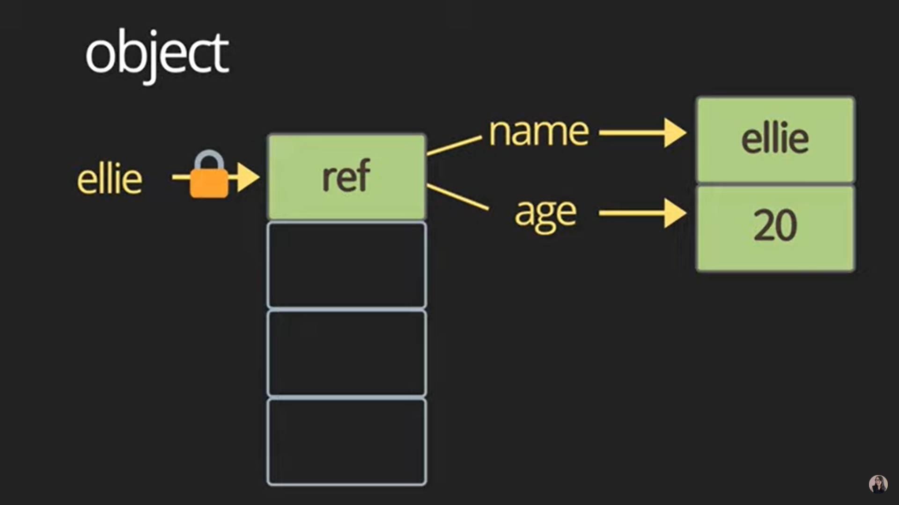

- Javascript offer amount of numbers over -2^53 to 2^53.

### 6. Operator

#### 6-1. String concatenation

- console.log('my' + ' cat');
  console.log('1' + 2);
  console.log(1 + 2);
  console.log(`String literals: 1 + 2 = ${1 + 2}`);

#### 6-2. Numeric operators

- console.log(1 + 1); // add
  console.log(1 - 1); // substract
  console.log(1 / 1); // divide
  console.log(1 \* 1); // multiply
  console.log(1 % 1); // reminder
  console.log(1 \*\* 1); // exponentiation

#### 6-3. Increment and decrement operator

- let counter = 2;
- const preIncrement = ++counter;
  console.log(`preIncrement: ${preIncrement}, counter: ${counter}`);
  ++counter is preincrement. According to sequence of operator, `counter = counter +1` should be operated at first, and then, variable named preIncrement should be counter. Please refer to below.
  // counter = counter + 1;
  // preIncrement = counter;

- const postIncrement = counter++;
  console.log(`postIncrement: ${postIncrement}, counter: ${counter}`);
  counter++ is postincrement. According to sequence of operator, `postIncrement = counter` should be operated at first, and then, `counter = counter + 1` should be operated. Please refer to below.
  // postIncrement = counter;
  // counter = counter + 1;

- const preDecrement = --counter;
  console.log(`preDecrement: ${preDecrement}, counter: ${counter}`);
  --counter is predecrement. According to sequence of operator, `counter = counter -1` should be operated at first, and then, variable named preDecrement should be counter. Please refer to below.
  // counter = counter - 1;
  // preDecrement = counter;

- const postDecrement = counter--;
  console.log(`postDecrement: ${postDecrement}, counter: ${counter}`);
  As above, please refer to below.
  // postDecrement = counter;
  // counter = counter - 1;

#### 6-4. Assignment operator

- let x = 3;
  let y = 6;
  x += y; // x = x+y;
  x -= y; // x = x-y;
  x *= y; // x = x*y;
  x /= y; // x = x/y;

#### 6-5. Comparison operator

- console.log(10 < 6); // falsy
  console.log(10 <= 6); // falsy
  console.log(10 > 6); // truthy
  console.log(10 >= 6); // truthy

#### 6-6. Logical operator

- Classified || (or), && (and), ! (not).

##### 6-6-1. || (or)

- console.log(`or: ${value1 || value2 || check()}`);
  function check() {
  for (let i = 0; i < 10; i++) {
  //wasting time
  console.log('wating time...');
  }
  return true;
  }

- Or operator should be completed when anyone of variables is true value among them even though Or operator do not complete to check all variables.
  It would be better to put heavy data on end of line compared with values like expression or function.

##### 6-6-2. && (and)

- console.log(`and: ${value1 && value2 && check()}`);

- And operator should be completed when anyone of variables is false. The operator do not need to operate continueously because one of parameter becomes false already.
  It would be better to put heavy data on end of line compared with values like expression or function.

##### 6-6-3. ! (not)

- console.log(!value1);

#### 6-7. Equality

- const stringFive = '5';
  const numberFive = 5;

##### 6-7-1. == loose equality, with type conversion

- console.log(stringFive == numberFive); // truthy
  console.log(stringFive != numberFive); // falsy

- Variable of stringFive is type of string and another variable is type of number. However, these types are considered same because loose equality offer type conversion.

##### 6-7-2. === strict equality, no type conversion

- console.log(stringFive === numberFive); // falsy
  console.log(stringFive !== numberFive); // truthy
- Conditional output would be printed after verifying their type through stric equality.
- It would be better to use stric equality to reduce your mistake.

##### 6-7-3. object equality by reference

- const ellie1 = { name: 'ellie' };
  const ellie2 = { name: 'ellie' };
  const ellie3 = ellie1;

- console.log(ellie1 == ellie2);
  Output should be false even thogh loose equality is used, because reference of their objects is different rather than type is different.

- console.log(ellie1 === ellie2);
  Output should be false for same reason above.

- console.log(ellie1 === ellie3);
  Output should be true because their pointer have same reference.

- console.log(null == undefined);
  Output should be true. I think their types are considered as same because thier variables are defined. One of them define value and the other do not define value. This is different between null and undefined. The difference of value do not care on loose equality condition.

### 7. Conditional operator (if)

- const name = 'ellie';
  if (name === 'ellie') {
  console.log('Welcome Ellie!');
  } else if (name === 'coder') {
  console.log('You are amazing coder!');
  } else {
  console.log('Unknown');
  }

- Output should be 'Welcome Ellie!' when parameter of if function is same as 'ellie' because conditional output is true.

- In case the parameter is not matched with 'ellie', conditional output would be false, and then, start to check whether the value is 'coder' or not.
  The parameter should be 'You are amazing coder!' when parameter of else if function is same as 'coder'.

- In case parameter is not matched with 'ellie' and 'coder', the other output should be 'Unknown' with parameter of else function.

### 8. Ternary operator (?)

- console.log(name === 'ellie' ? 'yes' : 'no');

- Format of ternary operator is 'condition ? value1 : value2'; like `condition ? value1 : value2;`.
  Output should be value1 if conditional output is true. The output should be value2 if not.

### 9. Switch statement

- Purpose

  1. use for multiple if checks
  2. use for enum-like value check
  3. use for multiple type checks in TS

- const browser = 'IE';
  switch (browser) {
  case 'IE':
  console.log('go away!');
  break;
  case 'Chrome':
  console.log('love you!');
  break;
  case 'Firefox':
  console.log('love you!');
  break;
  default:
  console.log('same all!');
  break;
  }

- In case value of variable matched 'IE', output should be 'go away!', and then, operator stopped.
- In case the value matched 'Chrome', output should be 'love you!', and then, operator stopped. In this way, switch operator would execute.
- In case output of Chrome and Firefox is same as above, duplicate codes could be removed below.
  `console.log('love you!') and break` like this.

- switch (browser) {
  case 'IE':
  console.log('go away!');
  break;
  case 'Chrome':
  case 'Firefox':
  console.log('love you!');
  break;
  default:
  console.log('same all!');
  break;
  }

- Keyword like break and continue are used to sort certain data you want.

- continue : skip this procedure and move to next procedure within the loop.

- for (let i=0; i < 11; i++) {
  if (i % 2 !== 0) {
  continue;
  }
  console.log(`EN: ${i}`);
  }

- This loop means iterate from 0 to 10 and print only even numbers. However, readability of loop is better the code below than the code above.

for (let i=0; i < 11; i++) {
if (i % 2 === 0) {
console.log(`EN: ${i}`);
}
}

- break : exit from loop completely.

- for (let i=0; i < 11; i++) {
  if (i > 8) {
  break;
  }
  console.log(`SN: ${i}`);
  }

- This loop means iterate from 0 to 10 and print numbers until reaching 8.

- function calculate (command, a, b){
  switch (command) {
  case 'add' :
  return a + b;
  break;
  case 'subrast' :
  return a - b;
  break;
  case 'multiply' :
  return a \* b;
  break;
  case 'devide' :
  return a / b;
  break;
  }
  }
  console.log(calculate('add',3,4));

- Switch loop also could be used to calculate numeric operators.

### 10. Loops

#### 10-1. While loop

- let i = 3;
  while (i > 0) {
  console.log(`while: ${i}`);
  i--;
  }

- While function would be operated continuously with truthy until conditional output becomes falsy.
  If you want function to execute after conditional output is verified, use while function.

#### 10-2. Do while loop

- do {
  console.log(`do while: ${i}`);
  i--;
  } while (i > 0);

- If you want function to execute before conditional output is verified, use do while function.

#### 10-3. For loop

- for (i = 3; i > 0; i--) {
  console.log(`for: ${i}`);
  }

- Format of for function loop is `begin; condition; step` like below.
  //for(begin; condition; step)
- The loop calls begin once and would be executed until condition is unmatched. In addition, keyword could use with varibale in begin session like below.
  //for(let i =3; i < 0; i--)

#### 10-4. Nested loop

- for (let i = 0; i < 10; i++) {
  for (let j = 0; j < 10; j++) {
  console.log(`i: ${i}, j: ${j}`);
  }
  }

- Nested loop means that other loops are inserted in a loop. As above, for function loop with variable j is inserted in for function loop with variable i. According to Big-O complexity notation, DB would be exponentiation of n(n^2) and logic can not be optimized for CPU becuase time complexity would raise and operating speed would be slower than before. Time of data input could increase rapidly as much as exponential function graph getting added variables. Time of get output would be very slow than before. Please refer below picture.

   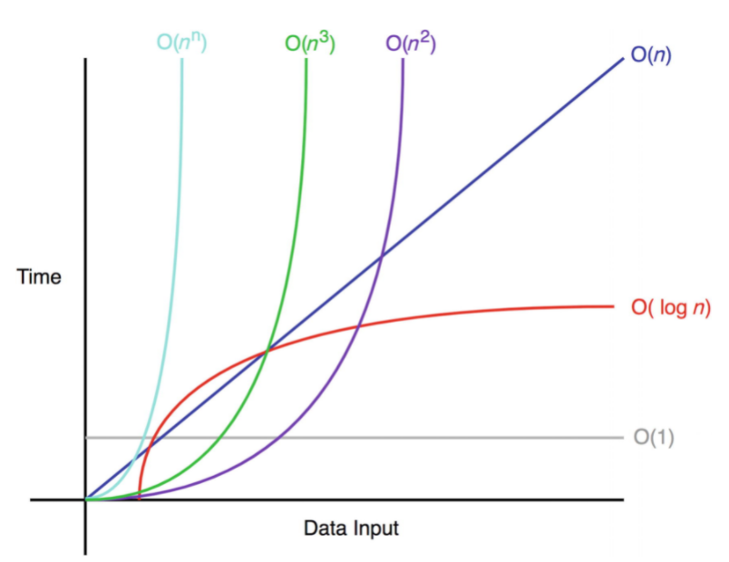

### 11. Function

- Fundermental building block in the program.
- Subprogram can be used multiple times.
- Performs a task or calculates a value.
- Format of function is `name(parameter1, parameter2) {basic business logic... return; }` like below.
  // function name(parameter1, parameter2) {
  bagic business logic;
  return;
  }

- Tips for declaration of function
  The choice of name of function is related with operated process of function. It would be better to write naming as verb or do something unlike noun for variable. One function should do one thing for better readability and visibility. If it is difficult for you to choose name of function, the function maybe be complicated. The complicated function should be divided to simple functions, and then, creat the naming per function.

- Function in main loop should be called after declaration of function as below.
  function log(message) {
  console.log(message);
  }
  log('hello');

#### 11-1. Callback function using function expression

- Callback function with function expression.
- Callback the function you want not only per procedure but also on event condition. Format of callback function is `condition, type of function, type of function`. It seems like ternary operator. The format of ternary operator is `condition ? value1 : value2`. The callback should be used type of functions except for values.

- function randomQuiz(answer, printYes, printNo) {
  if (answer === 'love you') {
  printYes();
  } else {
  printNo();
  }
  }
  const printYes = function () {
  console.log('yes!');
  }
  const printNo = function () {
  console.log('no!');
  }
  randomQuiz('wrong', printYes, printNo);
  randomQuiz('love you', printYes, printNo);

- Functions named 'printYes', 'printNo' should be declared. Callback function could use the functions named 'printYes', 'printNo' as parameters. It would be useful to feed watchdog and exit infinit loop.

- - In case of all codes, Please refer file named `main3.js`.

#### 11-2. Callback function with class

- Please remind that class is just template and object could use class to get output.

- Parameter and one of field should be defined on contructor function in class. And then, method function use one of field. In terms of constructor function, this means that input is same as one of output. Input could be variable or function() because input is not only primitive value but also object. In terms of method function, use callback function to get output when without undefined value.
  Other functions could use as object to get a variety of outputs when use `const object = new Class();`. In case you want to get output of function named `printSomething`, use `const coolCounter = new Counter(printSomething);`. In case of function named `alertNum`, use `const coolCounter = new Counter(alertNum);`. The one of field named callback and output of method is same. This is callback function and the callback function could use the object function as input and output because the callback function already refer the reference of object function.

- `class Counter` `{`
  `constructor(runEveryFiveTimes)`{
  this.counter = 0;
  console.log(this.counter);
  `this.callback = runEveryFiveTimes;`
  console.log(runEveryFiveTimes);
  }
  `increase()` {
  this.counter++;
  console.log(this.counter);
  if (this.counter % 5 === 0) {
  `this.callback(this.counter);`
  }
  }
  `}`
  `function printSomething(num)` {
  console.log(`yo! ${num}`);
  }
  `function alertNum(num)` {
  alert(`Wow! ${num}`);
  }
  `const coolCounter = new Counter(printSomething);`
  coolCounter. increase();
  coolCounter. increase();
  coolCounter. increase();
  coolCounter. increase();
  coolCounter. increase();

- In case of all codes, Please refer file named `main2.js`.

    

#### 11-3. Arrow function

- Arrow function is anonymous function.

- const simplePrint = function () {
  console.log('simplePrint!');
  }

- In terms of function expression, sentence 'function' and {} needed when declaration of function like above. However, in terms of arrow function, sentence 'function' and local scope '{}' do not need to like below. Same output could be got regardless of function expression and arrow function. It would be useful for array.

- const simplePrint = () => console.log('simplePrint!');
  const add = (a,b) => a + b;

#### 11-4. IIFE: Immediatly Invoked Function Expression

- function hello() {
  console.log('IIFE');
  }
  hello();

- Output generally should be got when called function after declaration of function like above. However, Output could be got with IIFE at the same time as declaration of function. scope `()` is used to cover the function, additional scope `()` is used to execute the function like below.

- (function hello() {
  console.log('IIFE');
  })();

### 12. Parameters

- Premitive parameters: passed by value
- Object parameters: passed by reference

- function changeName(obj) {
  obj.name = 'coder';
  }
  const matthew = { name: 'matt' };
  changeName(matthew);
  console.log(matthew);

- Immutable type of variable is object named 'matthew' when `const matthew = { name: 'matt'}`. The reference of object would be created in somewhere that heap memory allocated. The reference means pointer. The object can not be changed because of locked pointer in heap memory. Value of object is 'matt' at first when `console.log(matthew);` and this is also object parameter of fucntion named 'changeName'. The value would be changed to 'coder' in stack memory by function named 'changeName', when `changeName(matthew); and console.log(matthew);`, after the reference is changed. 'matt' and 'coder' are the value contained reference. 'coder' is also changed object parameter inside changed reference.

#### 12-1. Default parameters

- function showMessage(message, from = 'unknown') {
  console.log(`${message} by ${from}`);
  }
  showMessage('Hi');
  Output should be operated correctly by two inputs named "message", "from". The output of ${from} should be unknown even though none of value of ${from} is written on console.log ,because parameter 'from' is already defined in the function with value of default.

#### 12-2. Rest parameters

- function printAll(...args) {
  for (let i =0; i < args.length; i++) {
  console.log(args[i]);
  }
  }
  printAll('start', 'coding', 'beginner');

- `...` means format of rest parameters. Parameter named `...args` would be transfered with type of array. 'start', 'coding', 'beginner' are arguments of the parameter. The argument mean not only factor of parameter but also defined variable in loop of function. The arguments are `i`, `start`, `coding`, `biginner`, parameter is `...args`. Please refer the function above. There is simply another way to operate as same below.

- function printAll(...args) {
  for (const arg of args) {
  console.log(arg);
  }
  }

#### 12-3. for..in vs for..of

- function printAll(...args) {
  for (const arg of args) {
  console.log(arg);
  }
  }

- Format of for..of `for(value of array)` is useful to check all existence values in the array.

- for (key in matthew) {
  console.log(key);
  }

- Format of for..in `for (key in obj)` is useful to check all existence keys in the object.

### 13. Early return, early exit

- function upgradeUser(user) {
  if (user.point > 10) {
  long upgrade logic...
  }
  }

- if loop should be operated with correct output when conditional parameter is over 10. It is not efficient and optimized for CPU because waiting time exist when conditional parameter is under 10. Early return needed to reduce waiting time in if loop. Please refer to below.

- function updgradeUser(user) {
  if (user.point <= 10) {
  return;
  }
  long upgrade logic...
  }

### 14. Class

- Class means grouping related datas. It seems like container.

- class person {
  name: value;
  age: value;
  speak();
  }

- Properties named name, age means not only key but also field. It seems like attribute in HTML. speak() means not only function but also method.
  Class consist of fields and methods. In case of without method, the class named data class.

- Class is just template. There is no data made from class in memory. The class should be declared to use objects.

   

- Object is instance of class. There is data made from object in memory. The object could be created and changed many times whenever you want.

  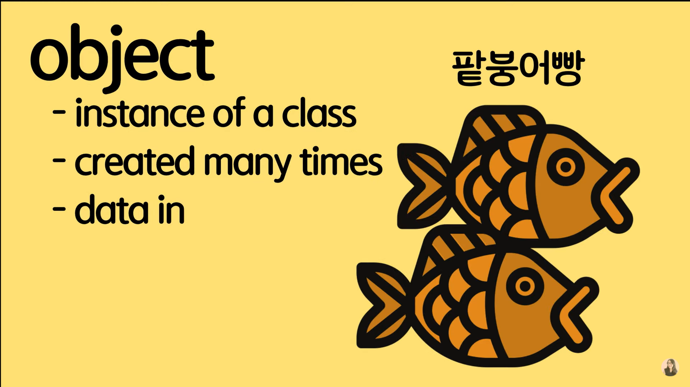

  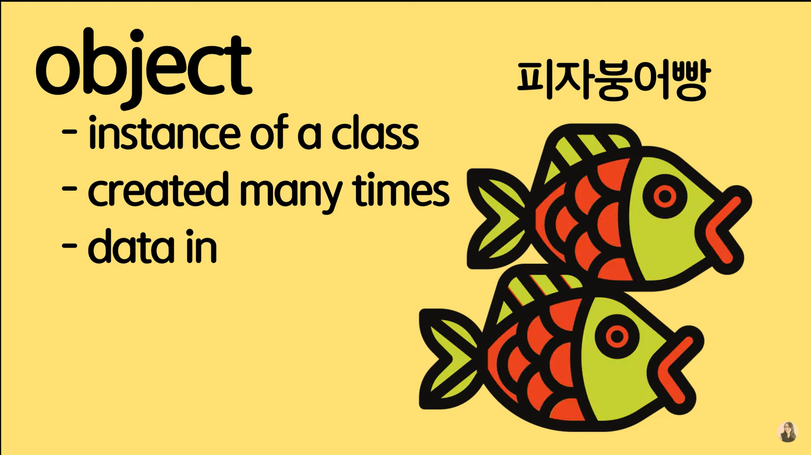

- Syntactical sugar over prototype-based inheritance. Syntactical sugar means only grammar should be added for user convenience without applied application data. This is close to callback function.

- class Person {
  constructor(name, age) {
  this.name = name;
  this.age = age;
  }
  speak() {
  console.log(`${this.name}: hello!`);
  }
  }
  const matthew = new Person('matt', 36);
  console.log(matthew.name);
  console.log(matthew.age);
  matthew.speak();

- In terms of fields, constructor function with fields named 'this.parameter' should be grouping and be defined within declared class to get correct outputs when created object. `this` is needed to get values of object when newly created object name like `matthew` above. `matthew` of `matthew = new person('matt', 36)` is object. `new person('matt', 36)` of `matthew = new person('matt', 36)` is template of class. User can creat object with template of class whenever you want as much as what you want.
  In terms of methods, function named verb should be added and be included after the fields within declared class because the verb function may use the defined fields.

#### 14-1. Get and Set

- In case that variable should be integer, get function and set function would be useful. The value could be 0 even though user inputs value of variable as negative value. It seems like compensation of value.

- class User {
  constructor(firstName, lastName, age) {
  this.firstName = firstName;
  this.lastName = lastName;
  this.age = age;
  }
  get age() {
  return this.\_age;
  }
  set age(value) {
  this.\_age = value < 0 ? 0 : value;
  }
  }
  const user1 = new User('Steve', 'JOb', -1);
  console.log(user1.age);

- `this.age` of `this.age = age;` in constructor should be loading `return this._age;` when get function declared as above.
  `age` of `this.age = age;` in constructor should be loading `value` of `this._age=value < 0 ? 0 : value;` when set function declared as above.
  In case `this._age` changed to `this.age` in get function and set function as same as `this.age` in constructor function, error occur named "call stack size exceeded" come from infinite loop. The reason why infinite loop occur is that variable named `this.age` is same and conflict among constructor function, get function, set function. So, variable of get function and set function should be different with constructor function. It seems like `this._age`.

#### 14-2. Fields of public and private

- class Experiment {
  publicField = 2;
  #privateField = 0;
  }
  const experiment = new Experiment();
  console.log(experiment.publicField);
  console.log(experiment.privateField);

- We can use value of fields without constructor function per object. In case publicField, value of object is express outside local scope of class.
  In case privateField with #, value of object can not express outside local scope of class.

#### 14-3. Static properties and methods.

- Fields and methods in class would be duplicated. The value of fields and methods should be generally used per object. However, field or method with keyword static could not be used with variable of object.

- class Article {
  static publisher = 'Coding beginner';
  constructor(articleNumber) {
  this.articleNumber = articleNumber;
  }
  static printPublisher() {
  console.log(Article.publisher);
  }
  }
  const article1 = new Article(1);
  const article2 = new Article(2);
  console.log(article1.publisher);
  article2.printPublisher();

- In case of Field, output named 'undefined' should be expressed even though object defined correctly like 'article1' or 'article2' if you use `console.log(article1.publisher);`.
  In case of Method, error named 'not a function' occur if you use `article2.printPublisher();`.
  Correct output should be expressed on console if you use defined variable in class not in object. `console.log(Article.publisher)` and `Article.printPublisher()` is good if you use keword `static`.
  So, in case you use common value regardless of objects, keyword static is useful to reduce usage of memory and minize memory.

#### 14-4. Inheritance and Diversity

- If you want to use common fields or methods frequently among other function, keyword 'extends' could be used.

- class Shape {
  constructor (width, height, color) {
  this.width = width;
  this.height = height;
  this.color = color;
  }
  draw() {
  console.log(`drawing ${this.color} color of`);
  }
  getArea() {
  return this.width _ this.height;
  }
  }
  class Rectangle extends Shape {}
  class Triangle extends Shape {
  draw() {
  super.draw();
  console.log(`gogogo`);
  }
  getArea() {
  return this.width _ this.height / 2;
  }
  toString() {
  return `Triangle: Color: ${this.color}`;
  }
  }
  const rectangle = new Rectangle(20, 20, 'blue');
  const triangle = new Triangle(20, 20, 'red');
  triangle.getArea();
  triangle.draw();
  rectangle.draw();
  rectangle.getArea();

- This class named 'Shape' define 3 fields of constructor and 2 methods for created objects. In case you want to creat new class with common function of previous class, use keyword 'extends' on basis of format like `class Rectangle extends Shape{}`.
  If you want to use one of methods as different value, output with your intends could be operated correctly according to the one's function code. For example, `class Triangle extends Shape{ getArea() { return this.width * this.height / 2;}}`. This means over-writing. Value of object named `triangle.getArea()` should be 200 with method defined on Triangle class. In contrast, Value of object named `rectangle.getArea()` should be 400 with other method named getArea() on Shape class. The method named getArea() has same name but operate differently between Shape class and Triangle class.
  In addition, if you want to get not only output of draw() on Triangle class but also output of draw() on Shape class at the same time, use `super.draw();` on Triangle class.

#### 14-5. class checking : instanceof

- If you want to check whether object is instance of class or not, use operator named 'instanceof'.

- console.log(rectangle instanceof Rectangle);
  console.log(triangle instanceof Rectangle);
  console.log(triangle instanceof Triangle);
  console.log(triangle instanceof Shape);
  console.log(triangle instanceof Object);
  console.log(triangle.toString() instanceof Object);

- In case of `triangle instanceof Shape`, output should be true because triangle is inheritance of Shape class.
In case of `triangle instanceof Object`, output should be true because Object is already defined in JS. Please refer to Object clicking on mousebutton with ctrl on file.js. You can see interface Object list.

  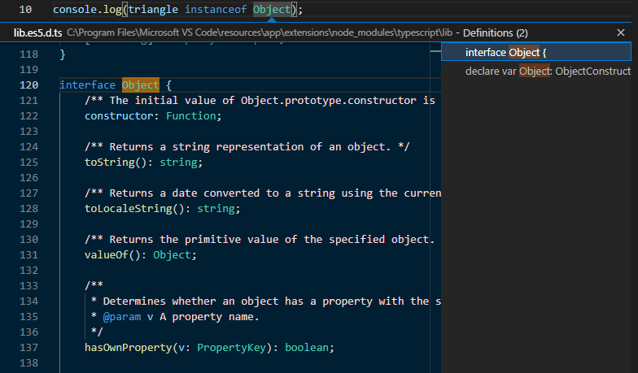

- In case of `triangle.toString() instanceof Object`, output should be false because `triangle.toString()` means object inside object and Object is not parent of triangle.toString(). The Object is paraent of triange.

### 15. Object

- Object is one of the Javascript's data types.
  The object is also collection and cluster of related data and/or functionality.
  Nearly all objects in Javascript are instances of `Object`.

- const name = 'ellie';
  const age =4;
  print(name, age);
  function print(name, age) {
  console.log(name);
  console.log(age);
  }

- In case codes are built without object, readability and visibility would worse than with object. It is hard to maintain web or application and solve the problems because there are fault with unknown root cause come from complicated codes and bad readability.

- function print(person) {
  console.log(person.name);
  console.log(person.age);
  }
  const matthew = {name: 'matt', age: 4};
  print(matthew);

- In case of parameter named 'person' on function named 'print', you do not need to declare 'person' parameter because Javascript offer the parameter.

#### 15-1. Literals and properties

- There are 2 type of syntaxs creating object in Javascript as below.

- const obj1 = {}; // 'object literal' syntax

- Format of object literal is `obj1 = { key : value};`. This means cluster of keys and values.
  The object named matthew have 2 keys and 2 values as above.

- const obj2 = new Object(); // 'object constructor' syntax

#### 15-2. Computed properties

- Key should be always string with square block like below for correct value. Otherwise, if key is not string, output should be undefined.

- console.log(matthew['name']); // correct output
  console.log(matthew[name]); // incorrect ouput means undefined

- In case input depends on user typing and you need the input, you can use computed properties because you can not know what user enter when you build coding function.
  The computed property maybe be useful to receive values related with key on dynamic condition

- function printValue(obj, key) {
  console.log(obj[key]);
  }
  printValue(matthew, 'name');
  printValue(matthew, 'age');

#### 15-3. Property value shorthand

- const person1 = {name : 'bob', age: 2};
  const person2 = {name : 'steve', age: 3};
  const person3 = {name : 'dave', age: 4};
  const person4 = makePerson('matt', 36);
  console.log(person4);
  function makePerson(name, age) {
  return {
  name: name,
  age: age,
  }
  }

- In case of creating object many times, developer has used function with return object since class added like above. Property value shorthand was developed to reduce the amount of code typing. The property value shorthand omits key if key and value is same in the function.

- function makePerson(name, age) {
  return {
  name,
  age,
  }
  }

- function with class is more familiar with developers than function with property value shorthand would be after class added. The function with class named constructor function.

#### 15-4. Constructor function

- function Person(name, age) {
  // this = {}; creat this object
  this.name = name;
  this.age = age;
  //return this;
  }
  const person4 = new Person('matt', 36);
  console.log(person4);

#### 15-5. In operator

- console.log('name' in matthew); // true
  console.log('age' in matthew); // true
  console.log('random' in matthew); // false

- Format of in operator is `key in obj` for property existence check. In case of existing key, output should be true. Otherwise, output should be false.

#### 15-6. Fun cloning

- const user = {name: 'matt', age: 20};
  const user2 = user;
  console.log(user2);

- const user3= {};
  for (key in user) {
  user3[key] = user[key];
  }
  console.log(user3);

- In case of old way, empty object is created at first and use for loop formated `for(key in user)` to clone keys of object named 'user' to object named 'user3' above.

- const user4 = {};
  Object.assign(user4, user);
  console.log(user4);

- Object is offered on default in Javascript and assign function could copy values of key or array of key to empty object. The format of assign is `Object.assign(dest, [obj1, obj2, obj3...])`.
  There is simply another way to operate as same and refer below.

- const user4 = Object.assign({}, user);

- The assign function could over-write value or array of latest property in sequence. In case of `Object.assign({}, fruit1)`, output of `console.log(mixed.size);` should be undefined bacause object of fruit1 do not define key of size. Otherwise, in case of `Object.assign({}, fruit1, fruit2)`, output of `console.log(mixed.size);` should be blue according to value of key of object named fruit2.

- const fruit1 = { color: 'red'};
  const fruit2 = { color: 'blue', size: 'big'};
  const mixed = Object.assign({}, fruit1, fruit2);
  console.log(mixed.color); // blue
  console.log(mixed.size); // big

### 16. Array

#### 16-1. Data structure

- In case there are many type of objects, they needs grouping similar some of objects. For example, rabbit is one of object. The object has 1 field named 'ear' and 2 methods named 'run' and 'eat'. In addition, carrot is one of other object. Other object has 2 field named 'vitaminC' and 'oranged color' without method. The object maybe has whether field or method according to characteristic of object. If there are many objects named 'rabbit' and 'carrot', grouping is needed. It seems like put in similiar objects per basket like picture. It is data structure that grouping similiar objects and then they are defined. Watch out put in a variety of objects on one basket.

   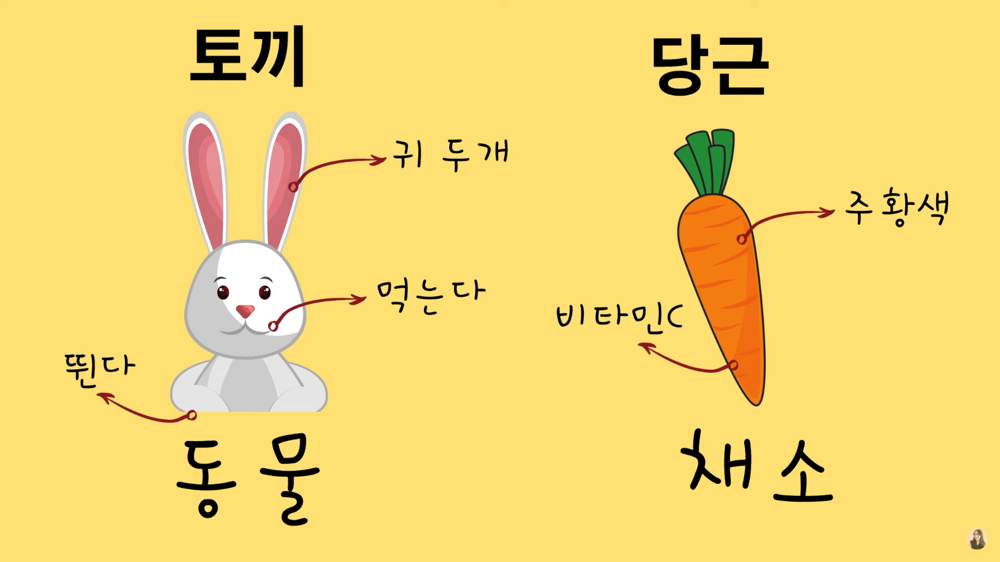
   

#### 16-2. Declaration

- const arr1 = new Array();
  const arr2 = [1, 2];
  console.log(arr1);
  console.log(arr2);

- arr1 is created on empty and arr2 is created with 2 index and 2 value. '0' index should be 1, 1 index should be 2. output of arr1 is `[]` and output of arr2 is `[1, 2]`.

   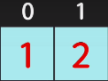

#### 16-3. Index position

- const fruits = ['apple', 'banana'];
  console.log(fruits);
  console.log(fruits[0]); // apple
  console.log(fruits[1]); // banana
  console.log(fruits[2]); // undefined
  console.log(fruits.length); // 2
  console.log(fruits[fruits.length -1]); // banana

#### 16-4. Looping over array

- Print all fruits

##### 16-4-1. for loop

- for(let i=0; i < fruits.length; i++) {
  console.log(fruits[i]);
  }

##### 16-4-2. for of loop

- for(let fruit of fruits) {
  console.log(fruit);
  }

##### 16-4-3. forEach()

- fruits.forEach(function (fruits, index, array) {
  console.log(fruits);
  });

- Correct outputs come from one of parameter named 'fruits'. 'fruit' is also possible because the 'fruit' was already defined on `for of loop`. Other outputs from 'index', 'array' are not printed because The other parameters are not used as input of `console.log()`.
  Add input named index or array of console.log() like `console.log(fruit, index, array);` within fruits.forEach() as defined parameters if you want get other outputs. `fruits.forEach(function (fruits, index, array) { console.log(fruits); })` is
  You can use arrow function because forEach API is anonymous function as below.

- fruits.forEach((fruit, index, array) => console.log(fruit));

##### 16-4-4. Addition, deletion, copy

- Push: add item to the end of array.

- fruits.push('strawberry', 'peach');
  console.log(fruits); // ['apple', 'banana', 'strawberry', 'peach']

- Add strawberry and peach to the end of array in sequence.

- Pop: remove item from the end of array.

- fruits.pop(); // remove one item
  fruits.pop();
  console.log(fruits); // ['apple', 'banana']

- Peach would be removed at first when fruits.pop(); and strawberry would be removed when second fruits.pop();.

- Unshift: add item to the beginning.

- fruits.unshift('lemon', 'melon');
  console.log(fruits); ['lemon', 'melon', 'apple', 'banana']

- Add lemon and melon to the beginning of array in sequence.

- shift : remove item from the beginning of array.

- fruits.shift();
  fruits.shift();
  console.log(fruits); // ['apple', 'banana']

- Lemon would be removed at first when fruits.shift(); and melon would be removed when second fruits.shift();.

- Push, pop function would be very faster than shift, unshift function. Push, pop use the end of index box to add or delete one of value. However, shift, unshift use the beginning index box. As values are shifted in sequence, the beginning empty index box would be created. The shift, unshift function use the empty index box to add or delete one of value.

- splice : format of splice is `(start number, deletecount number)`. In case use only start number without deletecount number, all values should be deleted from start number.
  So, deletecount number should be needed like `fruits.splice(1,1);`.
  If you want to add additional values instead of deleted values, use `fruits.splice(1, 1, 'watermelon');`.

- const fruits = ['apple', 'banana', 'strawberry', 'lemon', 'peach'];
  fruits.splice(1);
  fruits.splice(1, 1);
  fruits.splice(1, 1, 'watermelon');
  console.log(fruits);

- concat : combine two or more arrays in sequence. Format of concat is (...items). combine original object(fruits) with added object(fruits2). Output should be 'apple', 'banana', 'watermelon', 'peach'.

- const fruits = ['apple', 'banana'];
  const fruits2 = ['watermelon', 'peach'];
  const newfruits = fruits.concat(fruits2);
  console.log(newfruits);

##### 16-4-5.Searching

- indexOf(): find index.

- console.log(fruits.indexOf('apple')); // 0
  console.log(fruits.indexOf('banana')); // 1

- In case of without value in object, output should be -1

- console.log(fruits.indexOf('lemon')); // -1

- In case of duplicated values in object, output should be based on first created that value. So, if you want to find next duplicated index of value, use lastindexOf().

- const fruits3 = ['apple', 'banana', 'apple'];
  console.log(fruits3.indexOf('apple')); // 0
  console.log(fruits3.lastindexOf('apple')); //2

- includes(): value check whether in object. boolean type of output is true or false.

- console.log(fruits.includes('apple')); // true
  console.log(fruits.includes('lemon')); // false

### 17. Resolution of failures

- symptom : `Uncaught SyntaxError : Invalid shorthand property initializer` appear when typed code below.
- function makePerson(name, age) {
  return {
  name = name,
  age = age,
  }
  }
- countermeasure: format of object `key: value` should be applied on return object.
- function makePerson(name, age) {
  return {
  name: name,
  age: age,
  }
  }

- symptom : value of index[0] is not deleted with for loop with pop() as below.
  const fruits = ['apple', 'banana', 'watermelon'];
  for(i=0; i < fruits.length; i++){
  let j = fruits.pop();
  console.log(j);
  }
- countermeasure : I will check..
